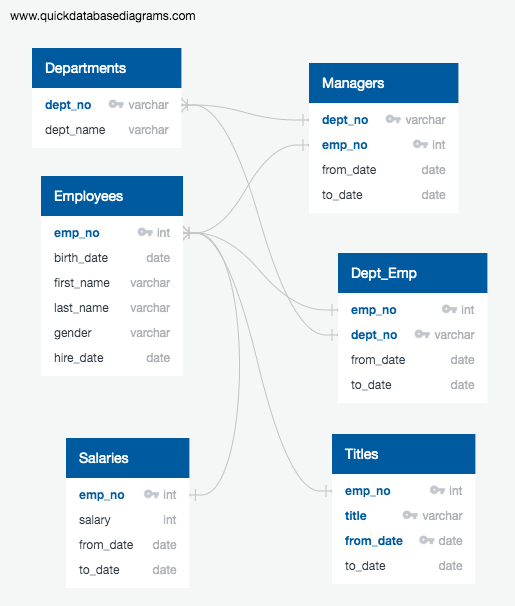
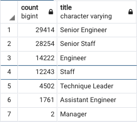
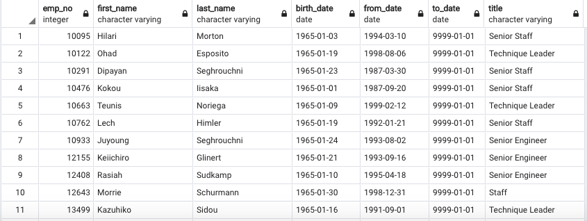
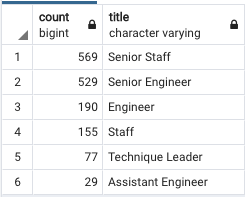
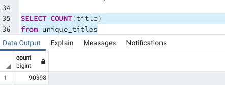
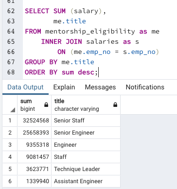
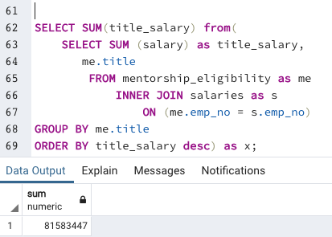

# Pewlett-Hackard-Analysis

## Project Overview

The purpose of this project was to utilize PostreSQL to aid a fictitious company called "Pewlett-Hackard" in analyzing company-wide employee data in order to safeguard their human resources from an upcoming "silver tsunami" in which baby-boomers may be retiring in large quantities in the near future.  The data source for the analysis included six CSV files, each consisting of pertinent information including tables identifying department, employees, managers, salaries, titles, as well as a department-employee table.

To assist the company in preparing for this foreboding employee retirement wave, an entity-relationship diagram was created to identify conceptual, logical, and physical relationships between each dataset (see below).  Along with this visual aid, two specific analyses were performed on the data.  Firstly, queries in PostgreSQL were constructed and executed to determine the number of employees born between 1952 and 1955 (presumably within retirment age) ordered according to their title in the company.  Secondly, an additional analysis was performed to create a table identifying employees born in 1965, considering these employees are nearing retirment age and, hence, may be eligible to participate in the company's mentorship program.

---------------------------------------------
## Resources:
Data Sources: departments.csv, dept_emp.csv
dept_manager.csv, employees.csv, salaries.csv
titles.csv

Software: PostgreSQL 12.4, pgAdmin 4, 
Visual Studio Code 1.49.2, Excel 16.42,
www.quickdatabasediagrams.com

---------------------------------------------
-----------------------------------------------

----------------------------------------------
## Results:

As a result of the first analysis, pertaining to number of retirement-age employees orgranized by title, the bulleted points are displayed here to visualize some key observations obtained:

- The results of the number of retiring employees ordered by title indicate that "Senior Engineers" is the title that contain the highest count of employees, specifically with 29,414 within retirement age. This constitutes 32.5% of the total employees within retirment age. 
- "Senior Staff" was a close second place at 28,254 retiring employees.
- Interestingly, there are only two managers within retirment age.  This is the only title cateogory counted as single-digits as all other catories contained well over a thousand retirment-age employees.
- There are 90,398 total employees in retirment age.
The results of this first analysis is summarized in the table below:

-----------------------------------------------

----------------------------------------------

From the second analysis, pertaining to employees born in 1965 that are eligible for the company's proposed mentorship program, the mentorship-eligibilty table provided a useful list with pertinent columns about those employees nearing retirement age.  Additionaly, although it was not required from the company, an additional "count table" was created to supplement the original mentorship-eligility table in order to compare it to the counts of the first analysis with ease.  After all, Pewlet-Hackard needs all the help they can get to prepare for the silver-tsunami ahead. Together, the required and non-required tables offered the following key observations:

- The total number of employees born in 1965 (those nearing retirment) amounts to 1,549 employees.
- The highest number of employees nearing retirement age was in the category of "Senior Staff", totaling 569 employees.
- The lowest number of employees nearing retirement age was for Assistant Engineers, totaling 29 employees.

The results of the second analysis can be seen from the following table (note this only a truncated display of the first eleven out of 1,549 rows):

-----------------------------------------------

----------------------------------------------

The following table is a count of the mentorship-eligible employees.  Note, this table will also be referred back to in the summary section below:

-----------------------------------------------

----------------------------------------------

## Summary

In conclusion, the use of PostgreSQL provided an excellent resource for querying employee data in order to better understand the relationships between relational data tables.  Specifically, the Pewlett-Hackard company may find the results to be highly useful in safeguarding their foreboding "silver-tsunami" of retiring employees.  In particular, the results obtained from the data analysis indicate that a variety of roles will need to be filled once the "silver-tsunami" takes affect.

For example, if we assume all of the employees within the retirment age (with birth dates from 1952 to 1955) will be retiring at the onset of the silver-tsunami, then that would result in a total of 90,398 retirees (see below).  That is, indeed, a lot of employees to replace.  As such, this begs the question as to whether there are enough retirement-ready employees currently in the company to actually mentor the next generation of Pewlett-Hackard employees.

-----------------------------------------------

----------------------------------------------

To answer this question, we may refer back to the supplementary table that was provided for additional insight in the results section.  From this supplementary "count" table we see that there are only 1,549 total employees who were born in 1965 and, therefore, eligible for the mentorhsip program.  Currently, that is a ratio of about 58 retirement-ready employees for every mentorship-eligible employee.  Thus, a mentorship program does appear to be a feasible solution for preparing these mentorship-eligible employees.  On the other hand, there will not be enough employees born in 1965 alone to fill all the roles that are likely to become vacant by the retirement-ready employees.

-----------------------------------------------

----------------------------------------------

As an additional query that may be useful in safeguarding the company, we may want to calculate the salaries per title for the employees eligible for the mentorship program.  This query may be useful for the company's financial planning as it will allow the company to see the current salary expenditure devoted to these specific employees nearing retirement per department.  That way, if the company chooses to adjust salaries depending on whether an employee enters a mentorship program, the company will be well-prepared with a clear understanding of the total salary expenses per department for these employees beforehand.  To determine the current salary expense of all these employees eligible for the program, that query would be executed as follows:

----------------------------------------------

Finally, if the company wanted to also see a total sum of the mentorship-eligible employee salaries, they may utilize the following query.  This query would allow the company to sum the totals of the previous table salaries which were grouped by title, offering Pewlett-Hackard a better understanding of the overall salary expenditure for these specific employees.  This would be useful to know, especially given this total expenditure may need adjustment, depending on the nature of the mentorship program.

---------------------------------------------------------